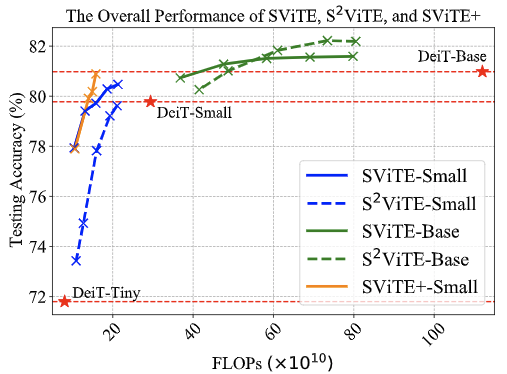
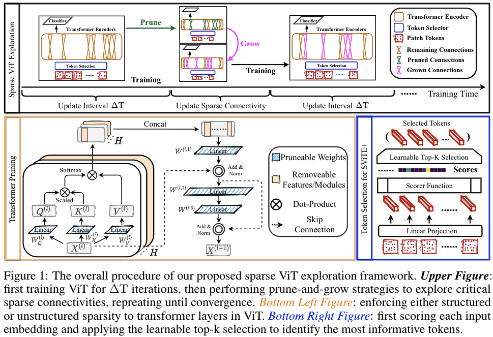

# Chasing Sparsity in Vision Transformers: An End-to-End Exploration

[](https://opensource.org/licenses/MIT)

Codes for [NeurIPS'21] [Chasing Sparsity in Vision Transformers: An End-to-End Exploration](https://arxiv.org/pdf/2106.04533.pdf).

Tianlong Chen, Yu Cheng, Zhe Gan, Lu Yuan, Lei Zhang, Zhangyang Wang


## Overall Results



Extensive results on ImageNet with diverse ViT backbones validate the effectiveness of our proposals which obtain significantly reduced computational cost and almost unimpaired generalization. Perhaps most surprisingly, we find that the proposed sparse (co-)training can even *improve the ViT accuracy* rather than compromising it, making sparsity a tantalizing “free lunch”. For example, our sparsified DeiT-Small at (5%, 50%) sparsity for (data, architecture), improves 0.28% top-1 accuracy, and meanwhile enjoys 49.32% FLOPs and 4.40% running time savings.


## Proposed Framework of SViTE




## Implementations of SViTE

### Set Environment

```shell
conda create -n vit python=3.6

pip install torch==1.7.1+cu101 torchvision==0.8.2+cu101 torchaudio==0.7.2 -f https://download.pytorch.org/whl/torch_stable.html

pip install tqdm scipy timm

git clone https://github.com/NVIDIA/apex

cd apex

pip install -v --disable-pip-version-check --no-cache-dir --global-option="--cpp_ext" --global-option="--cuda_ext" ./

pip install -v --disable-pip-version-check --no-cache-dir ./
```

### Cmd

Command for unstructured sparsity, i.e., SViTE.

- SViTE-Small

```shell
bash cmd/ vm/0426/vm1.sh 0,1,2,3,4,5,6,7
```

Details

```shell
CUDA_VISIBLE_DEVICES=$1 \
python -m torch.distributed.launch \
    --nproc_per_node=8 \
    --use_env main.py \
    --model deit_small_patch16_224 \
    --epochs 600 \
    --batch-size 64 \
    --data-path ../../imagenet \
    --output_dir ./small_dst_uns_0426_vm1 \
    --dist_url tcp://127.0.0.1:23305 \
    --sparse_init fixed_ERK \
    --density 0.4 \
    --update_frequency 15000 \
    --growth gradient \
    --death magnitude \
    --redistribution none
```

- SViTE-Base

```shell
bash cmd/ vm/0426/vm3.sh 0,1,2,3,4,5,6,7
```

Details

```shell
CUDA_VISIBLE_DEVICES=$1 \
python -m torch.distributed.launch \
    --nproc_per_node=8 \
    --use_env main.py \
    --model deit_base_patch16_224 \
    --epochs 600 \
    --batch-size 128 \
    --data-path ../../imagenet \
    --output_dir ./base_dst_uns_0426_vm3 \
    --dist_url tcp://127.0.0.1:23305 \
    --sparse_init fixed_ERK \
    --density 0.4 \
    --update_frequency 7000 \
    --growth gradient \
    --death magnitude \
    --redistribution none
```

**Remark.** More commands can be found under the "cmd" folder.

Command for structured sparsity is comming soon!


## Pre-traiend SViTE Models.

1. SViTE-Base with 40% structural sparsity ACC=82.22

https://www.dropbox.com/s/ix7mmduvf0wlc4b/deit_base_structure_40_82.22.pth?dl=0

2. SViTE-Base with 40% unstructured sparsity ACC=81.56

https://www.dropbox.com/s/vltm4piwn9cwsop/deit_base_unstructure_40_81.56.pth?dl=0

3. SViTE-Small with 50% unstructued sparsity and 5% data sparisity ACC=80.18

https://www.dropbox.com/s/kofps21g857wlbt/deit_small_unstructure_50_sparseinput_0.95_80.18.pth?dl=0

4. SViTE-Small with 50% unstructured sparsity and 10% data sparsity ACC=79.91

https://www.dropbox.com/s/bdhpc6nfrwahcuc/deit_small_unstructure_50_sparseinput_0.90_79.91.pth?dl=0


## Citation

```
@misc{chen2021chasing,
      title={Chasing Sparsity in Vision Transformers:An End-to-End Exploration}, 
      author={Tianlong Chen and Yu Cheng and Zhe Gan and Lu Yuan and Lei Zhang and Zhangyang Wang},
      year={2021},
      eprint={2106.04533},
      archivePrefix={arXiv},
      primaryClass={cs.CV}
}
```


## Acknowledge Related Repos

ViT : https://github.com/jeonsworld/ViT-pytorch

ViT : https://github.com/google-research/vision_transformer

Rig : https://github.com/google-research/rigl

DeiT: https://github.com/facebookresearch/deit
